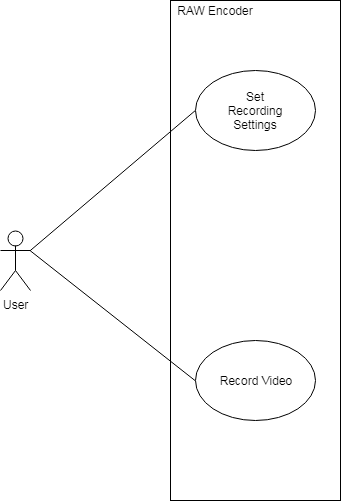

# RAW Video Recorder

## Project Abstract
Modern digital video generates a huge data stream that must be stored in some fashion. In most applications this is handled through compression of an RGB image. Many algorithms have been devised over the years, most customized to a specific purpose.

Most color cameras available at this time utilize a single image sensor. In order to allow a single sensor to record all three colors, the sensor uses a color filter array (CFA) arranged in what is referred to as a "Bayer Pattern". In this configuration, each pixel in the sensor senses only red, green, or blue. The other two values are determined by interpolation within the camera. The parameters used in this process affect all aspects of the image.

Over the last decade the industry has acknowledged the creative benefits of preserving the “Bayer Pattern” encoded data as it comes off of the image sensor. By manipulating the data in this format the creator has greater control over the image, as well as allowing for more radical changes to the image before artifacts appear. The recording of a CFA pattern image has become known as recording a "RAW" image. 

Another benefit of recording this "RAW" image is an immediate reduction in data rate. Reducing the needed bandwidth for a 4K video from GBs/sec, to hundreds of MBs/sec. While this reduction is significant, it still requires a very fast storage medium. In many cases RAW video is needed, but the quality of uncompressed video is not. 

At this time there exist very few compression algorithms that can compress RAW video effectively. Most suitable compression methods employ highly tuned predictors to achieve the desired compression ratios. Since the RAW CFA data only records one of the primary colors at each location, the predictors in the algorithms become ineffective. Several groups have released compressed RAW formats. Cineform RAW, and RED's REDCODE were two of the first. In the last few months Apple released PRORES RAW, and Blackmagic Design released their own format. None of these are open formats, in the case of REDCODE the output is in fact encrypted to prevent reverse engineering. Neither Apple nor Blackmagic Design have provided information on decoding their format.

Cineform, now the most open of them all, was eventually acquired by GoPro and used in their cameras, eventually being standardized by the SMPTE as the VC5 codec. In late 2017 GoPro open sourced the SDK and codec, both of which are available in a public GitHub repo. Unfortunately there is a complete lack of documentation, and the VC5 standard is copyrighted and not distributable. 

### Project Purpose

In recent years there has been a push by the open source community to "hack" off the shelf cameras to improve quality and add features not supported by the manufacture. In one case, a group is working to release a completely open camera design. Apertus has grown significantly over the years after a successful crowdfunding campaign. While their camera has been evolving, there has been very little effort put to a recording solution. For this project I would like contribute a piece to that solution.

## Project Relevance
This project relates to several of the educational objectives of this course. It requires the coordination of team members to work on several different parts of a complex project. Issues will need to be reported, and tracked to a fix. It will require a solid overall object oriented design, with a well thought test plan. It requires the use of external libraries, and APIs. The use of multi-threading and potentially parallel computing to provide desired performance. In addition there will be a need for significant optimization and code profiling to identify and correct bottlenecks in the system. In the end if this is to be useful it will also need usable documentation.
 

## Conceptual Design
The core goal of this project will be to produce a module that can compress a 4K RAW video stream. This module would be targeted to perform realtime encoding using the NVIDIA Jetson platform. This is an embedded module providing a high performance ARM processor and NVIDIA GPU in a mobile platform.The project would read frames from the Jetsons camera, and use the OpenJPEG and gpu-jpeg2k libraries to process and compress the images before storing them to disk. There are several methods of preparing the RAW data for encoding proposed, in this case the simplest of the methods would be implemented. The code would designed to be modular and allow for change of the preprocessor.

## Background

* APERTUS Project: https://apertus.org/
* CINEFORM SDK: https://github.com/gopro/cineform-sdk
* Open JPEG: http://www.openjpeg.org/
* gpu-JPEG: https://github.com/etalab/gpu-jpeg2k
* CUDA accelerated DWT: https://code.google.com/archive/p/gpudwt/
* GPU DWT implementation details: https://www.sitola.cz/papers/858064.pdf
* Bayer Pattern pre-processing: http://www.ece.ubc.ca/~colind/papers/doutre_TCSVT2008.pdf

## Required Resources
- Team members should be comfortable with C and C++, and the use of external libraries. Some CUDA and parallel computing background would be helpful. Experience with matrix mathematics and signal processing is also a plus.
While the complex portions of the project are part of existing libraries, the more knowledgeable the team is the more opportunity for optimization. 

- Team members should have access to a Linux system with working tool chain. They will need to setup for cross platform development using NVIDIA's free SDK. Will require an NVIDIA Jetson system. Team has once available, if there are other unused modules around, remote access would be fantastic.
